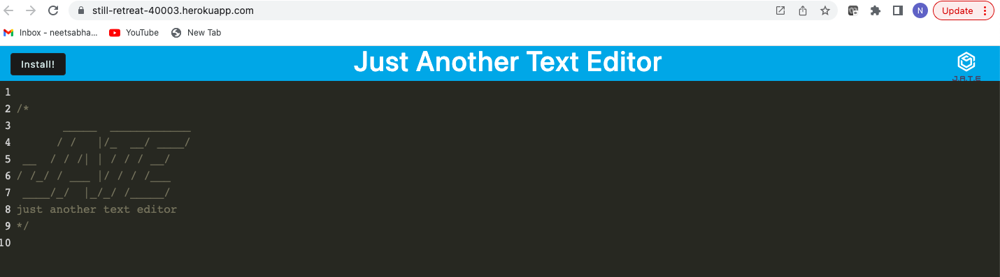

# Text Editor Starter Code

Text editor that runs in the browser. Single Page Application that meets the PWA criteria. Multiple data pesistence techniques, functions offline as well.

  ## Table of Contents 
  - [Description](#description)
  - [Screenshot](#screenshot)
  - [Installation](#installation)
  - [Usage](#usage)
  - [Contribution](#contribution)
  - [Testing](#testing)
  - [Additional Info](#additional-info)

  ## Description:
  Text editor that runs in the browser. Single Page Application that meets the PWA criteria. Multiple data pesistence techniques, functions offline as well.

  ## Screenshot:
  

  ## Installation:
  'npm i' through the command line to install the necessary packages. 
  Execute 'npm start' and app should run on PORT 3010.
  Or visit https://still-retreat-40003.herokuapp.com/

  ## Usage:
  'npm start' or https://still-retreat-40003.herokuapp.com/
  
  ## Contribution:
  No contributions please.

  ## Testing:
  Tested thoroughly in develompment environment.
  
  ## Additional Info:
  - Github: [neetsabharwal](https://github.com/neetsabharwal)